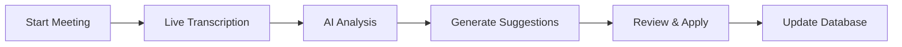

# Zudia+ 🎯

<div align="center">

**Transform Legal Meetings into Actionable Insights**

[](LICENSE)
[](CONTRIBUTING.md)

</div>

---

## 📖 About

Zudia+ is an AI-powered legal technology platform designed to analyze live meetings, provide real-time compliance insights, and automate legal document updates. It bridges the gap between verbal discussions and contractual obligations, ensuring that your legal documents are always in sync with your latest negotiations.

---

## ✨ Core Features

### 🎙️ Real-Time Meeting Analysis

Transcribes audio from live meetings, identifies compliance issues, and extracts actionable items as the meeting happens.

### 📄 Intelligent Clause Mapping

Connects discussion points from the meeting directly to specific clauses within your existing legal documents.

### 💡 AI-Powered Suggestions

Automatically generates suggested revisions for document clauses based on the meeting's transcript and compliance analysis.

### 🔄 One-Click Document Updates

Empowers users to instantly review, select, and apply suggested changes directly to the clauses stored in the database.

### 📚 Centralized Document Database

A "Database Viewer" to manage and access all your legal documents, PDFs, and their indexed clauses in one place.

### 🤖 Legal Assistant Chatbot

An integrated AI assistant to answer on-demand questions about compliance, legal terms, and regulations.

---

## 🔄 How It Works



### Workflow Steps

1. **Start a Meeting**: Begin a new session and start the "Live Transcription." Zudia+ listens and transcribes in real-time.

2. **Live Analysis**: As the meeting progresses, the "AI Analysis" module runs in the background, flagging potential compliance risks (e.g., "Termination Notice period is too long") and identifying clear "Action Items."

3. **Generate Suggestions**: After the meeting, navigate to the "Suggest Changes" feature. The AI analyzes the meeting insights and compares them to the relevant documents in your "Database Viewer," generating specific, actionable changes for your legal clauses.

4. **Review & Apply**: The system presents a list of proposed updates to your existing clauses. You can review each suggestion, select the ones you want to accept, and apply them directly to the documents.

5. **Update Database**: With one click, the accepted changes are applied, and your legal document clauses are instantly updated in the database.

---

## 💻 Tech Stack

| Component          | Technology          |
| ------------------ | ------------------- | --- |
| **Frontend**       | React, Tailwind CSS |
| **Backend**        | Next.js / Python    |     |
| **NLP/Analysis**   | Gemini              |
| **PDF Processing** | pdf-lib / PyMuPDF   |

---

## 🚀 Getting Started

### Prerequisites

Before you begin, ensure you have the following installed:

-  Node.js (v18.x or later)
-  npm / yarn
-  Python (v3.10 or later)
- 🔑 Access to AI API Keys (e.g., OpenAI)

### Installation

1. **Clone the repository**

```bash
git clone https://github.com/your-username/zudia-plus.git
cd zudia-plus
```

2. **Install Frontend Dependencies**

```bash
cd frontend
npm install
```

3. **Install Backend Dependencies**

```bash
cd ../backend
pip install -r requirements.txt
```

4. **Set up Environment Variables**

Create a `.env` file in the `backend` directory:

```env
OPENAI_API_KEY=your_api_key_here
DATABASE_URL=your_database_connection_string
```

### Running the Application

1. **Start the Backend Server**

```bash
cd backend
python app.py
```

2. **Start the Frontend**

```bash
cd ../frontend
npm run dev
```

3. **Open your browser**

Navigate to `http://localhost:3001` to access Zudia+

---
